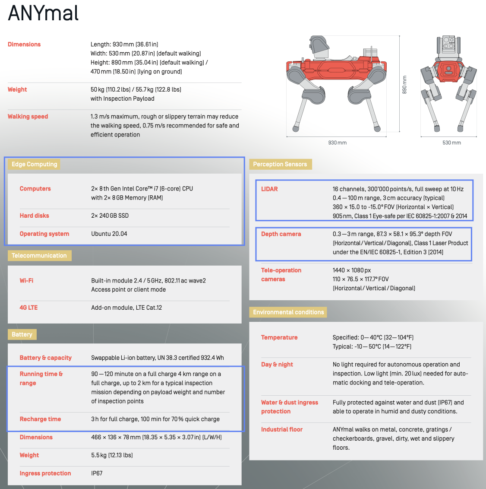
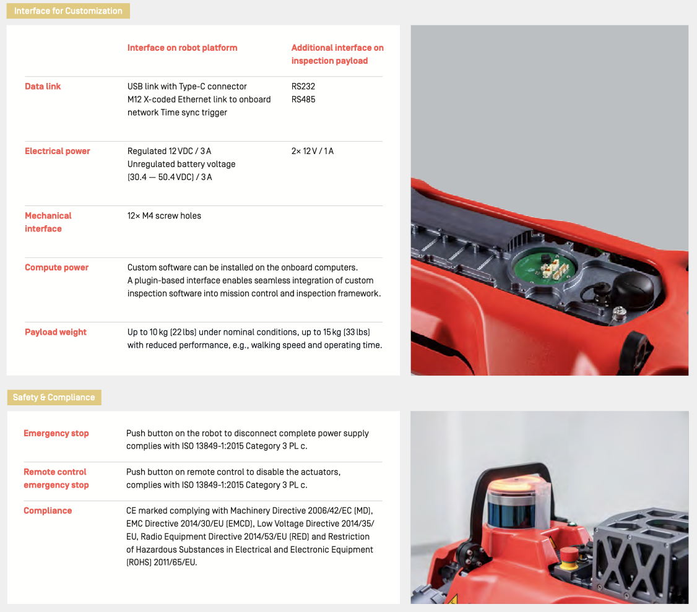

# Anymal Document and SDK Collection

### 1.1. Structure
```shell script
anymal_docs_sdk
├── README.md
├── docker                         # docker files
├── docs                           # documents
├── sdk/anymal-research-software   # anymal research software (only for whom has Anybotics account)
```

## Tutorial list 
### Fast Search Document
1. [Simple Record of Command](docs/simple_record_command.md)
2. [Hardware Connection](docs/hardware_connection.md)

### Development Pipeline
1. Take the training courses
2. Explore the usage of anymal software on the public operator PC
3. Install the operator GUI using the [Anymal installer](https://anymal-research.docs.anymal.com/user_manual/anymal_d100_operators_manual-workforce_app/release-24.02/html/Operators_Manual/Getting_started/Install_the_operator_GUI_using_the_ANYmal_Installer.htm)
   - Choose an organization: **anymal-research-software** if you are a research customer (including UCL).
   - [Link to updating the release](https://anymal-research.docs.anymal.com/user_manual/anymal_d100_operators_manual-workforce_app/release-23.12/html/Operators_Manual/Service_and_maintenance/Upgrade_the_software_and_firmware_of_the_Robot/Upgrade_the_Robot_software/Upgrade_to_a_new_release.htm):
		```
		sudo sh -c 'echo "deb [arch=amd64] https://packages-ros.anybotics.com/ros/release-24.02/ubuntu $(lsb_release -sc) main" > /etc/apt/sources.list.d/any-ros.list' &&
		sudo sh -c 'echo "deb [arch=amd64] https://packages.anybotics.com/anymal-research-software/release-24.02/ubuntu $(lsb_release -sc) main" > /etc/apt/sources.list.d/anymal.list'
		sudo apt update
		sudo apt upgrade
		sudo apt autoremove
		sudo apt autoclean
		```
		- Install simulation: ```sudo apt install ros-noetic-anymal-d-sim```

### Document
1. Operator manual of Anymal-D: [pdf](docs/anymal_d_operators_manual.pdf) and [online document](https://anymal-research.docs.anymal.com/user_manual/anymal_d100_operators_manual-workforce_app/release-23.12/html/PlaceHolder-Topics/LaunchPage.htm).
2. Cheat sheet of Anymal-D: [pdf](docs/anymal_d_cheat_sheet.pdf).
3. Datasheet of Anymal-D: [pdf](docs/anymal_d_datasheet.pdf).
4. Three-hour training course as an Anymal operator: [pdf](docs/anymal_d_operator_training.pdf) and [online video](https://training.anybotics.com/course/anymal-gend-operator).
	 - Page 12-13: system overview
	 - Page 14: hardware interfaces
	 - <div align="center">
			<a href="">
				
			</a> 
		 </div>
	 - <div align="center">
			<a href="">
				
			</a> 
		 </div>    
5. Demo of introducing Anymal: [online video](https://www.anybotics.com/watch-legged-robot-anymal-demo/?submissionGuid=d6799ef3-13b3-4735-ad4a-62826e565e9a).

### Courses 
1. [ETH-Marco Hutter Robot Dynamics HS2021](https://www.youtube.com/watch?v=CGecbHfasbI&list=PLE-BQwvVGf8GMY11YEONylkQNu0UWj0VE&index=30)

## Codebase (Please click the name to visit the website)
1. [Anybotics Anymal Research](https://code.anymal.com/)
	 - [Anymal research software stack](https://code.anymal.com/anymal-research-software/anymal-research-software)
	 - [Anymal code examples for industrial applications](https://code.anymal.com/anymal/code_examples)
	
2. [RSL Anymal Research](https://rsl.ethz.ch/publications-sources/publications.html)
	 - Mapping:
    	 - [Elevation Mapping-Cuda](https://github.com/leggedrobotics/elevation_mapping_cupy)
    	 - [Neural-Based Elevation Mapping](https://github.com/mstoelzle/solving-occlusion#solving-occlusion-in-terrain-mapping-with-neural-networks)
	 - Planning:
    	 - [ArtPlanner](https://github.com/leggedrobotics/art_planner?tab=readme-ov-file#anymal-rough-terrain-planner): Sampling based path planning for ANYmal, based on 2.5D height maps using learned motion cost.

### ANYbotics Contact Person 
1. [Global Research Community Manager -- Benjamin Mottis](mailto:bmottis@anybotics.com)

