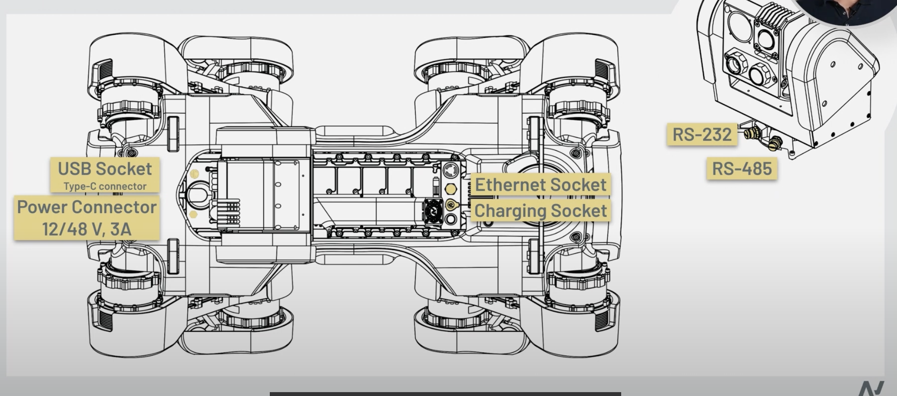
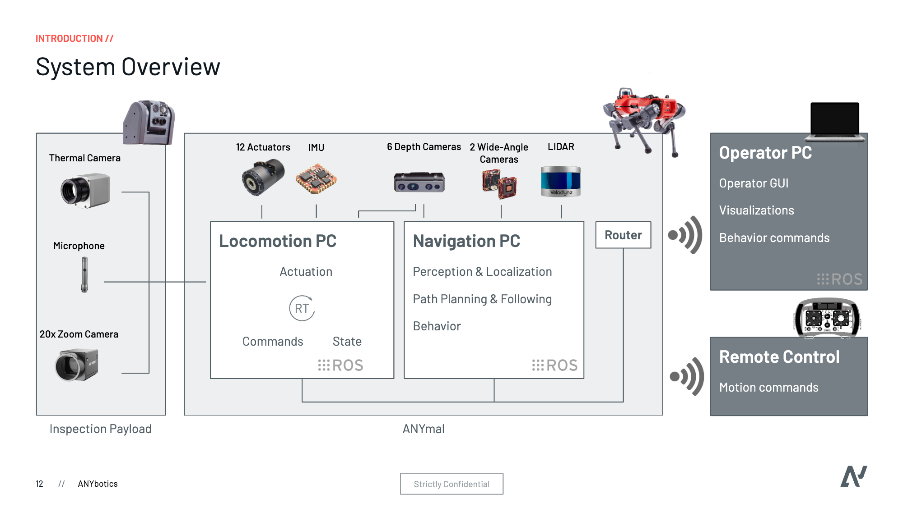
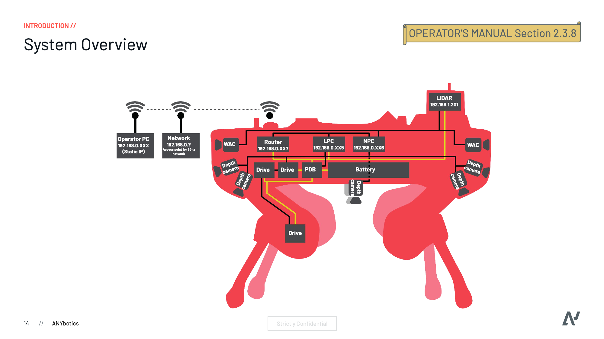
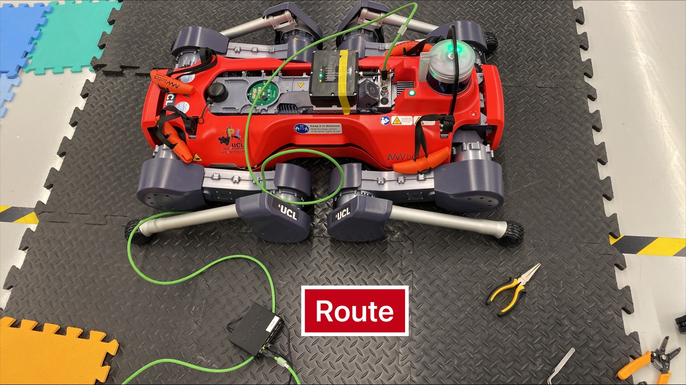
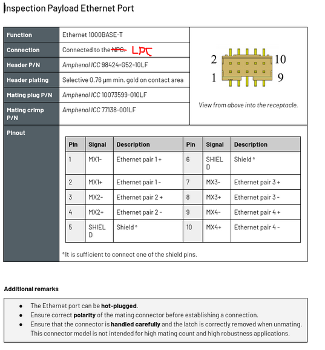
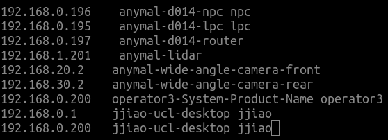
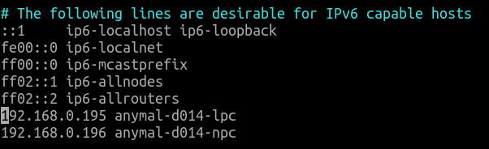
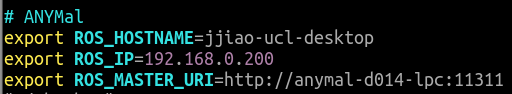
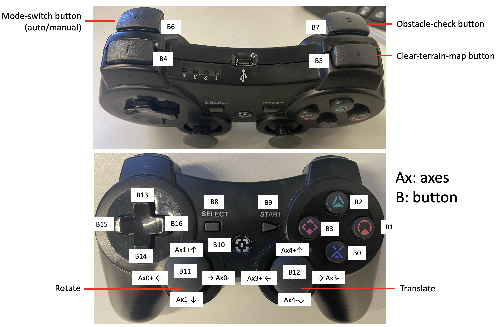
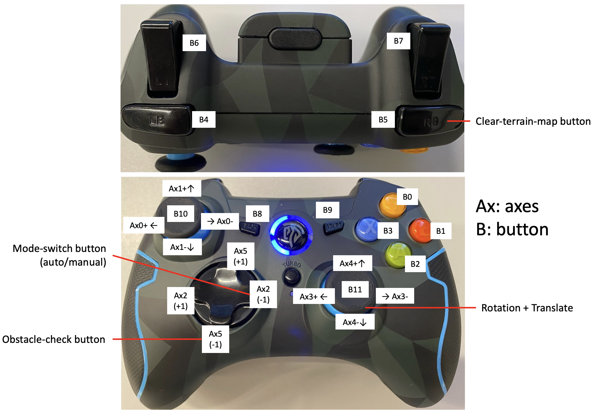

## Hardware Connection
This document will reocrd commends that are usually be used

### Interfaces
<div align="center">
  <a href="">
    
  </a> 
</div>

</br>

<div align="center">
  <a href="">
    
  </a> 
</div>

</br>

<div align="center">
  <a href="">
    
  </a> 
</div>

</br>

<div align="center">
  <a href="">
    
  </a> 
</div>

**NOTE:** Connect to the Robot: Green line is connected to the robot. Black line is connected to the PC with internet. 

<div align="center">
  <a href="">
    
  </a> 
</div>

### Common Operations
1. [Link to share the WIFI network with the robot](https://anymal-research.docs.anymal.com/user_manual/anymal_d100_operators_manual-workforce_app/release-23.12/html/Operators_Manual/Service_and_maintenance/Upgrade_the_software_and_firmware_of_the_Robot/Share_the_internet_connection_from_the_OPC_to_the_Robot.htm), and use ssh to check the connection.

2. Operations to build up ROS communication between NPC/LPC and OPC

   - Add ```ip pc_name username``` in ```/etc/hosts``` in NPC/LPC such as
      <div align="left">
        <a href="">
          
        </a> 
      </div>
     
	- Add ```ip pc_name username``` in ```/etc/hosts``` in OPC such as
      <div align="left">
        <a href="">
        
        </a> 
      </div>     
     
   - Add these lines in ```~/.bashrc``` in OPC such as (you can also comment these lines if you use your own ROS)
     <div align="left">
       <a href="">
         
       </a> 
     </div>     

### Note
1. [Livox-Mid360](https://terra-1-g.djicdn.com/851d20f7b9f64838a34cd02351370894/livox%20mid%20360%20%E7%94%A8%E6%88%B7%E4%BD%BF%E7%94%A8%E6%89%8B%E5%86%8C240222/Livox_Mid-360_User_Manual_EN.pdf)
   - The working voltage is from 9V to 27V, the recommended voltage is 12V
2. Jetson Orin
   - Power Supply: It is 7~20V, 5A for type-C or DC jack. The P/N of DC jack is AC0002-0011-001-HH, you can get its spec by searching online. [how to power on](https://developer.nvidia.com/embedded/learn/jetson-agx-orin-devkit-user-guide/howto.html)
3. [Azure Kinect DK](https://learn.microsoft.com/en-us/azure/kinect-dk/hardware-specification)
   - Install Kinect SDK
     ```
      wget https://packages.microsoft.com/ubuntu/18.04/prod/pool/main/libk/libk4a1.4-dev/libk4a1.4-dev_1.4.1_amd64.deb &&
      wget https://packages.microsoft.com/ubuntu/18.04/prod/pool/main/libk/libk4a1.4/libk4a1.4_1.4.1_amd64.deb &&
      wget https://packages.microsoft.com/ubuntu/18.04/prod/pool/main/k/k4a-tools/k4a-tools_1.4.1_amd64.deb &&
      sudo apt install -y libsoundio1 &&
      sudo dpkg -i libk4a1.4_1.4.1_amd64.deb &&
      sudo dpkg -i libk4a1.4-dev_1.4.1_amd64.deb &&
      sudo dpkg -i k4a-tools_1.4.1_amd64.deb &&
      git clone https://github.com/microsoft/Azure-Kinect-Sensor-SDK.git &&
      sudo cp Azure-Kinect-Sensor-SDK/scripts/99-k4a.rules /etc/udev/rules.d/ &&
     ```
   - Power Supply:
     - USB-C: It consumes up to 5.9 W; specific power consumption is use-case dependent. A passive cable should be less than 1.5m in length. If longer, use an active cable. The cable needs to support at least 1.5A. Otherwise you need to connect an external power supply. The USB certified cable must support both power and data.
     - Others: The in-box power supply cable is a USB Type-A to single post barrel connector. Use the provided wall power supply with this cable. The device is capable of drawing more power than two standard USB Type-A ports can provide.
   - Install Driver:
     - ```sudo apt install ros-noetic-rgbd-launch && catkin build azure_kinect_ros_driver```
     - ```bash path_to_RPL-Robohike/config_launch_anymal/scripts/run_anymal_sensor_setup.bash```
     - NOTE: ```WFOV_UNBINNED``` for indoor navigation or scanning objects with shorter distance but wider FoV
     - NOTE: ```NFOV_2X2BINNED``` for outdoor navigation tasks with longer distance
3. [Joystick] Definition of each axis and button
    **Joystick-PS3**
    <div align="left">
      <a href="">
        
      </a> 
    </div>
    
    **Joystick-ESM-9013**
    <div align="left">
      <a href="">
        
      </a> 
    </div>