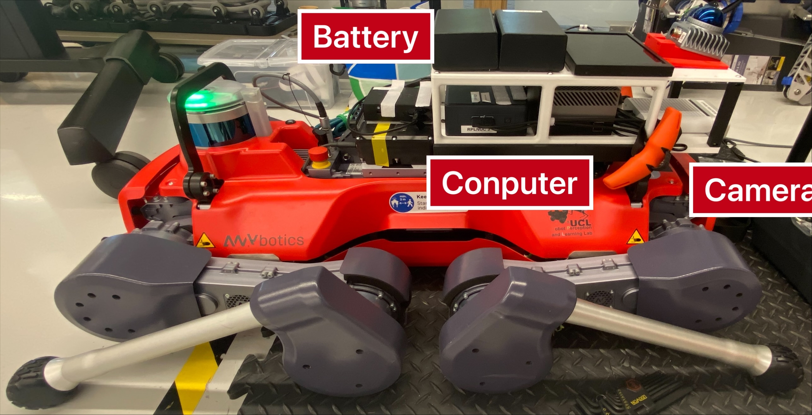

## Run Program On Anymal with the CMU Navigation System

### Start Hardware
1. Connect the bettery with the NUC and Jetson Orin.
2. Login the **jjiao** account with the password.
3. Check whether the network connection of the NUC is **Anymal_Shared_Network**.
4. Turn on the Anymal and swith its mode as **walking mode**.
5. Run ```./start_vnc.sh``` on both the NUC and Jetson, you can use the Remmina to remote control them.
<div align="center">
  <a href="">
    
  </a> 
</div>

### Start VNC
1. (NUC/Jetson) settings -> sharing -> scene sharing (turn on)
2. (User PC) open Remmina Remote Destkop -> create a VNC setting -> click connect
<div align="center">
  <a href="">
    
  </a> 
</div>

### Start Sensor
1. Setup sensor on the NUC: 
   ```
   cd ~ && ./run_nuc_sensor_setup.sh
   ```
2. Setup sensor on the Jetson: 
   ```
   cd ~ && ./run_orin_sensor_setup.sh
   ```

### RUN the CMU Navigtion System on Anymal
1. Check whether sensor data is ready:
   ```
   rostopic hz /livox/imu
   ```
2. Setup cmu navigation:
   ```
   cd ~ && ./run_nuc_anymal_real_navigation_system.sh
   roslaunch config_launch_anymal/launch/cmu_exploration/anymal_real_system.launch
   ```
   A rviz will open and visualize message
3. Use the [joystick](image/joystick_esm9013_description.png) and click the ```start``` button, you can see message in the terminal
   ```
   [Navigation Control] Will republish velocity to /motion_reference/command_twist message
   ```
   This means that your joystick is taking the control
4. Provide a waypoint and enjoy
5. [Emergency] Use the ANYMal joystick to avoid any danger.
