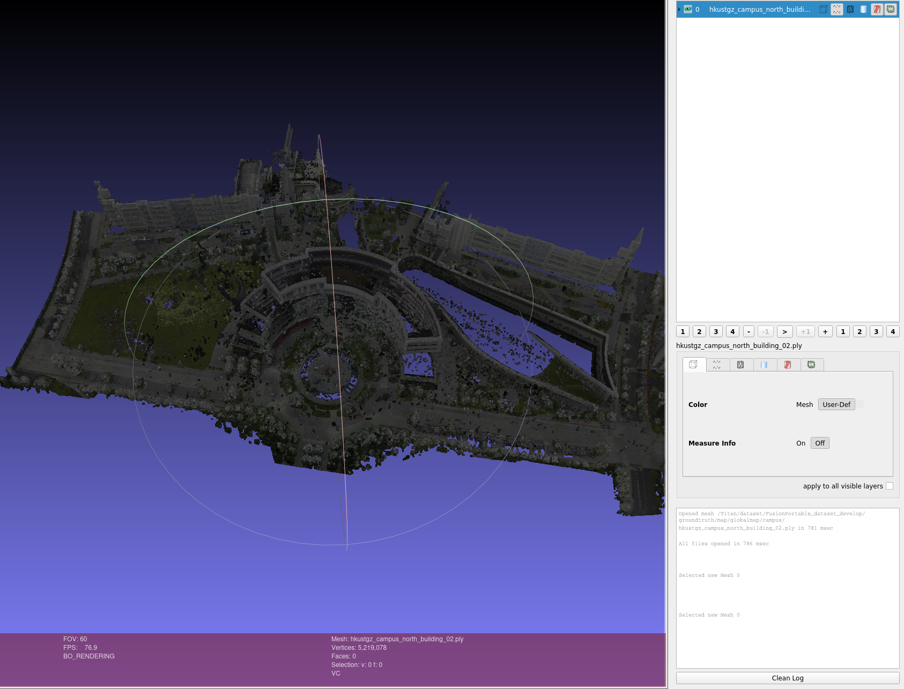
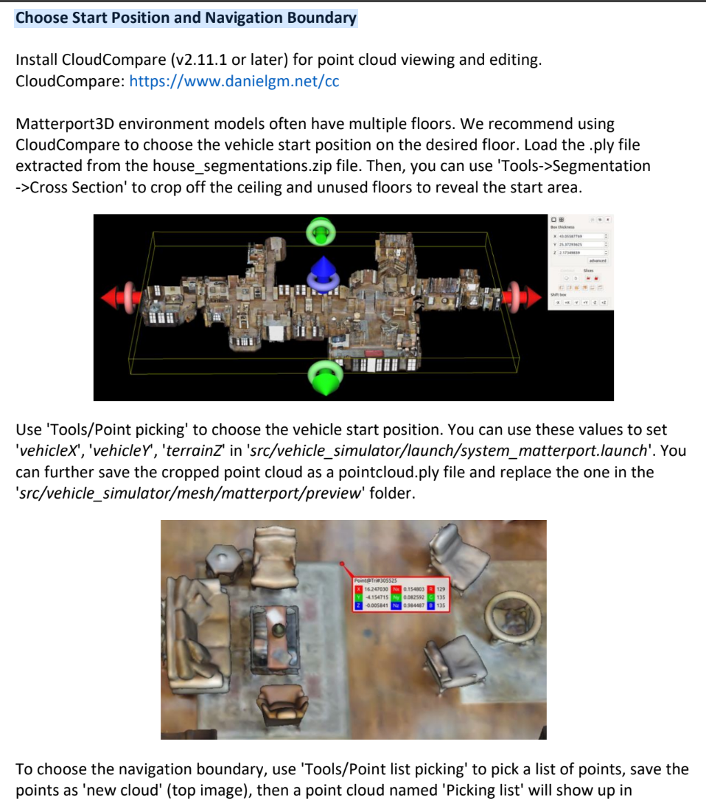
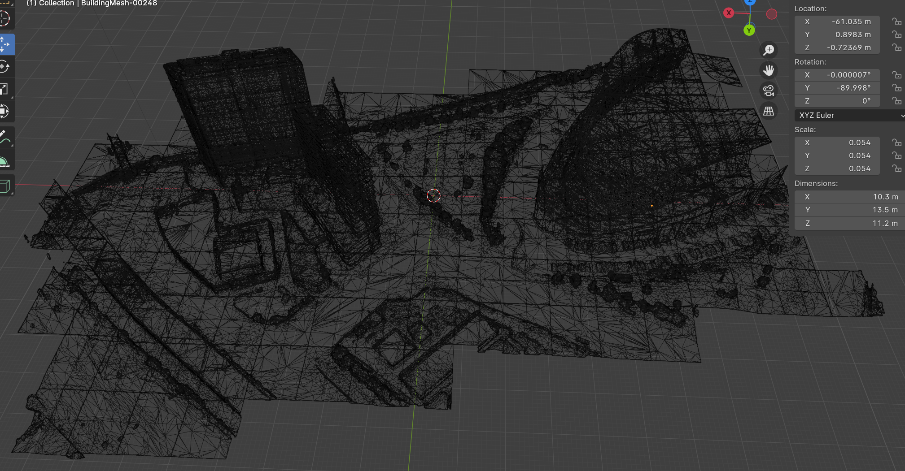
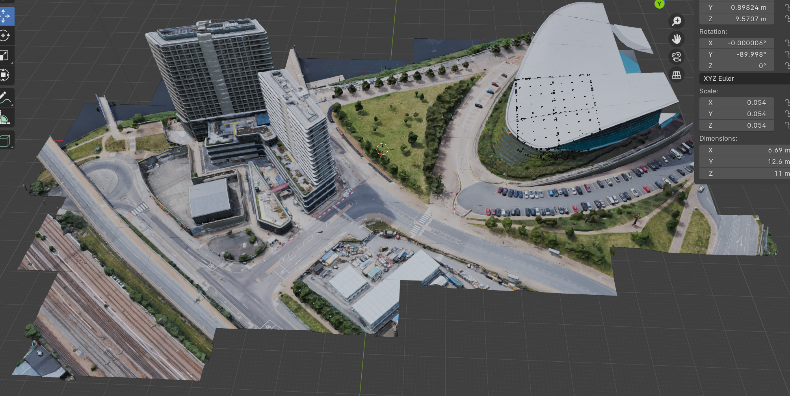

## Setup Your Own Simulated Environment

### Case 1: Import RGB-D Point Cloud into Gazebo
#### Requirement:
1. Install meshlab
2. PCD file: scene.pcd

#### Steps:
1. Terminal-convert pcd to ply: ```pcl_pcd2ply scene.pcd scene.ply```
2. Meshlab:
    * Open scene.ply
      <div align="center">
        <a href="">
          
        </a> 
      </div>
    * **Compute normal:** Filters → normals, curvature, operation → compute normals for pointset → neighbor: 100
      * Visualize normla: Render → show normal
    * **Compute mesh:** Remeshing, simplification, reconstruction → surface reconstruction: screened poisson/ **VGG**
      * Save mesh: Export mesh as dae and ply

3. CloudCompare
  <div align="center">
    <a href="">
      
    </a> 
  </div>

### Case 2: Use the matterport3D
1. Download [havitat-sim](https://github.com/facebookresearch/habitat-sim) and follow this [tutorial](https://drive.google.com/file/d/1xV3L2xW4JtPMZpY8t43aqlXDhraZYLDi/view) for the usage.

### Case 3: Import 3D Mesh from the Google Map into Gazebo
1. Tutorial:
    * Bilibili (Chinese): [tutorial video](https://www.bilibili.com/video/BV1fv411s7cc/?spm_id_from=333.337.search-card.all.click)
    * Youtube: [tutorial video](https://www.youtube.com/watch?v=X6Q7dbtXVZQ)
2. Download the [MapsModelsImporter](https://github.com/eliemichel/MapsModelsImporter?tab=readme-ov-file) and follow the tutorial
    * Click the [MapsModelsImporter download link](https://github.com/eliemichel/MapsModelsImporter/releases)
    * Steps: ```launch chrome``` - ```launch RenderDoc``` - ```open google map``` - ```press PrtSc``` - ```save capture in RenderDoc``` - ```launch blender and install MapsModelsImporter``` - ```load .rdc``` - ```export models as obj```
    <div align="center">
      <a href="">
        
      </a> 
      <a href="">
        
      </a>     
    </div>
3. Launch Meshlab, open ```*obj```, and then save ```*.ply```, ```*.dae```, ```*_pointcloud.ply```

### Case 4: (not successfully debug) Using [AirSim simulator](https://microsoft.github.io/AirSim) for photorealistic render
1. The original [README](https://github.com/caochao39/aerial_navigation_development_environment?tab=readme-ov-file)
2. Installation in the computer or the docker container
    * AirSim simulator requires Python 3.5 or later. On your computer, make sure pip3 points to Python 3.x (x>=5). 
    Use ```pip3 --version``` to check the version. To install pip3, use sudo ```apt install python3-pip```. And then
    ```
    pip3 install msgpack-rpc-python && pip3 install airsim
    sudo apt install ros-<distribution>-tf2-sensor-msgs ros-<distribution>-tf2-geometry-msgs
    sudo apt install ros-<distribution>-mavros*
    ```
    * Build AirSim and AirSim ROS. This requires gcc-8 or higher. Use gcc --version to check the version.
    ```
    git clone https://github.com/Microsoft/AirSim.git
    cd AirSim && ./setup.sh && ./build.sh
    cd ros && catkin_make
    ```
    * If there are any issues to complete the steps above, please refer to this [documentation](https://microsoft.github.io/AirSim/airsim_ros_pkgs).
3. Run the AirSim
    * Download an AirSim environment from the AirSim release page. Click any version of the releases and find the 'Assets' at the bottom of the page. 
    The default environment that we use is named 'AirSimNH'. Download and unzip the file, then copy the 'src/airsim_utils/config/settings.json' file from the development environment to the 'AirSimNH/LinuxNoEditor' folder.
    * In a terminal, go to the 'AirSimNH/LinuxNoEditor' folder and launch AirSim.
    ```./AirSimNH.sh -windowed```
    * In a second terminal, go to the 'AirSim/ros' folder and launch AirSim ROS Wrapper.
    ```source devel/setup.bash```
    ```roslaunch airsim_ros_pkgs airsim_node.launch```
    * In a third terminal, go to the development environment folder and launch our system.
    ```source devel/setup.sh```
    ```roslaunch vehicle_simulator system_airsim.launch```
    * Now users can use the controller to try smart joystick flight and manual flight, and click the 'Waypoint' button in RVIZ to try waypoint flight. Note that users can turn off the AirSim main window to reduce graphics rendering load and increase data render framerate, by changing 'FlyWithMe' to 'NoDisplay' in the 'AirSimNH/LinuxNoEditor/settings.json' file.