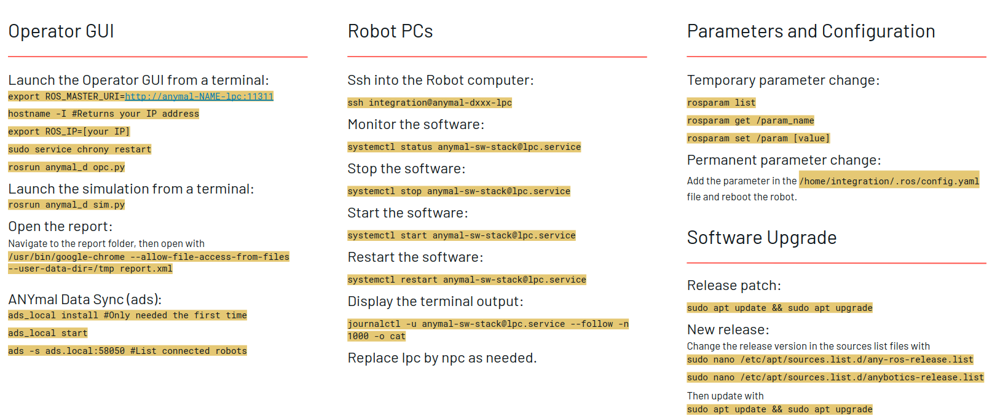

## Record of Commands
This document will reocrd commends that are usually be used

### Cheat Sheet
<div align="center">
  <a href="">
    
  </a> 
</div>

### Other Commands
1. Setup lpc and npc server: ```anymal_setup -a d014```
2. 

### Experimental Tools
1. Case: if you want your anymal to walk outside and remotely control the PC desktop without the reliance of Internet, please refer [VNC-Viewer within WLAN](vnc-connection.md)