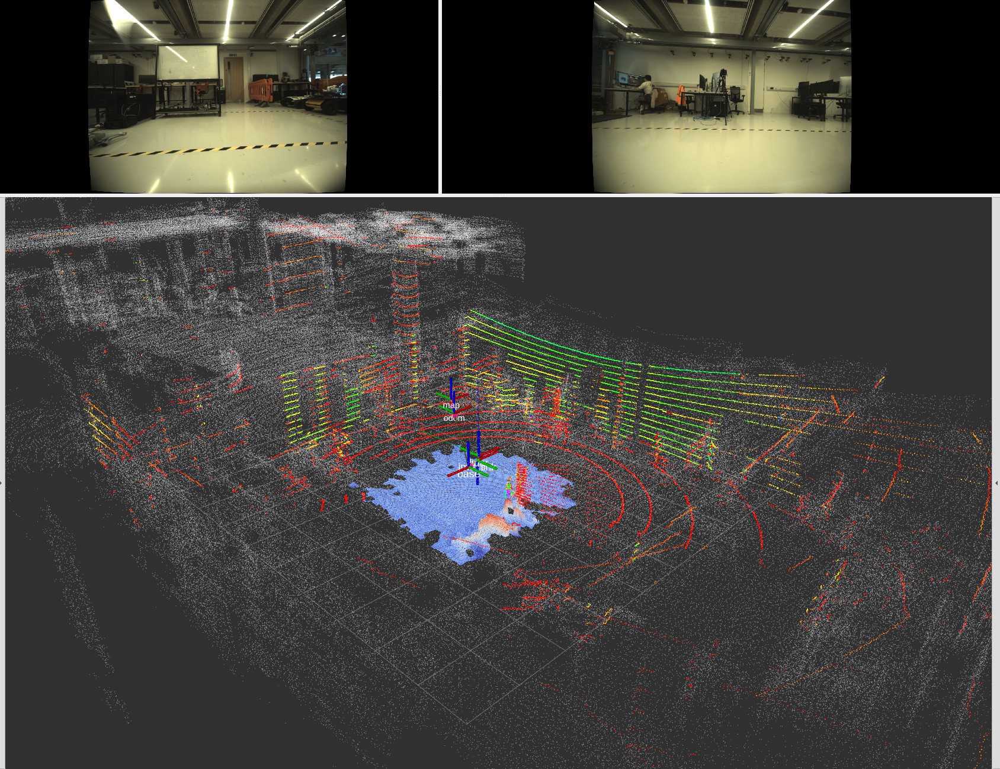
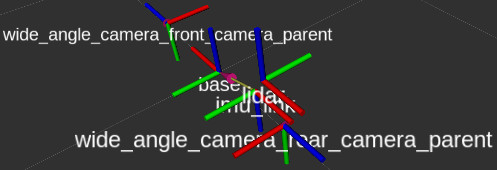
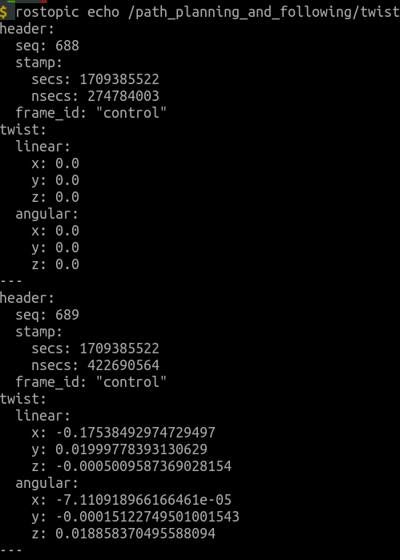
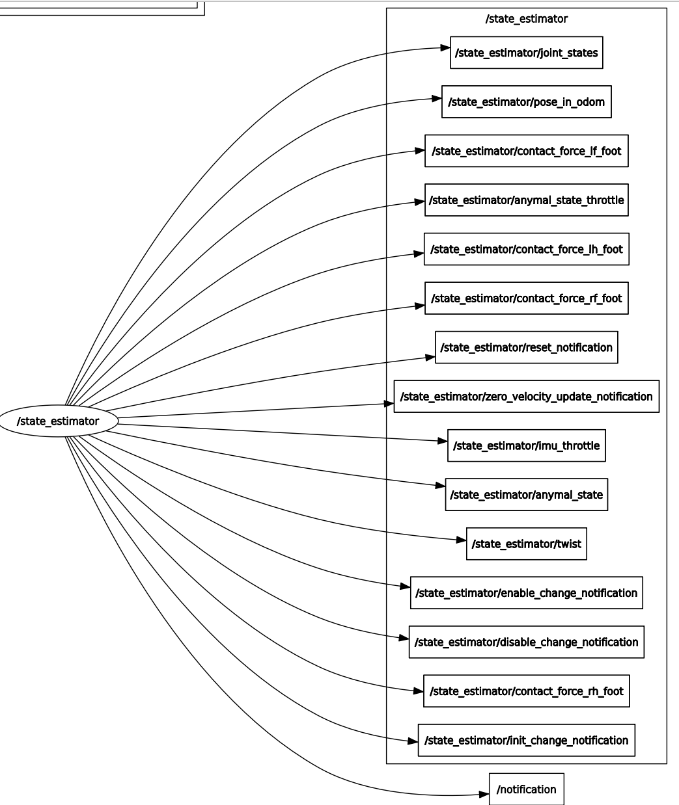
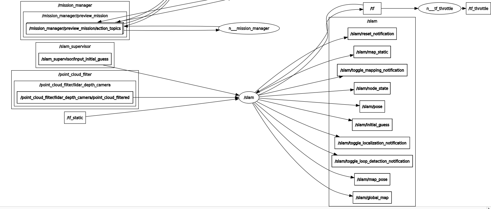
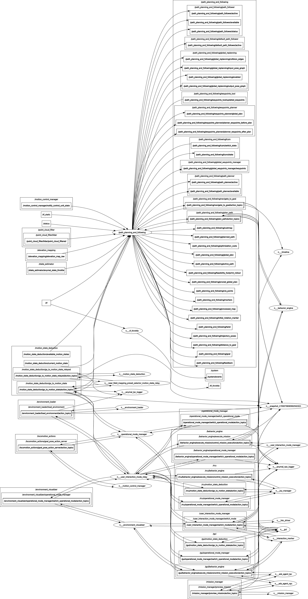
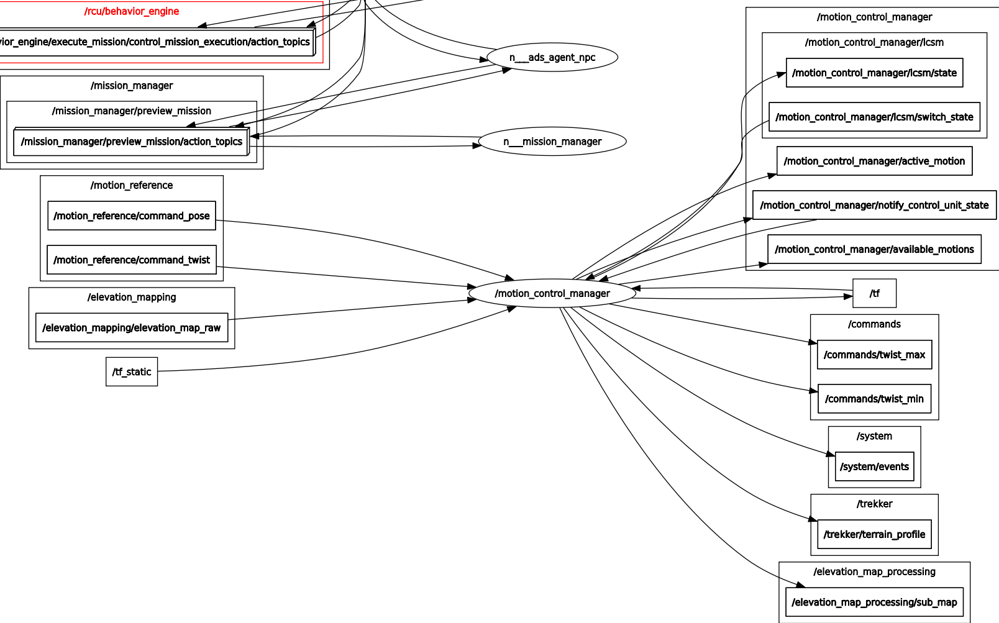

## Software Connection

### ROS Topic
##### Map, LiDAR scan, TF
<div align="center">
  <a href="">
    
  </a> 
</div>

##### TF
<div align="center">
  <a href="">
    
  </a> 
</div>

##### Twist
<div align="center">
  <a href="">
    
  </a> 
</div>

##### Twist
<div align="center">
  <a href="">
    
  </a> 
</div>

```shell script
/state_estimator/anymal_state: state of base and joint, using priproc data
/state_estimator/pose_in_odom: state in the odometry representation
/slam/pose/pose: state in the point cloud map using lidar
```

### ROS Rqt_graph
##### state_estimator
<div align="center">
  <a href="">
    
  </a> 
</div>

##### slam
<div align="center">
  <a href="">
    
  </a> 
</div>

##### path_planning
<div align="center">
  <a href="">
    
  </a> 
</div>

##### motion_control
<div align="center">
  <a href="">
    
  </a> 
</div>

- (subscribe) desirable position and orientation, but not used in auto mode (simulation)
```shell script
/motion_reference/command_pose
```
- (subscribe) desirable linear and angular velocity, not published in both auto and manual mode (simulation)
```shell script
/motion_reference/command_twist
```
- (publish) the motion state 
  - Normal waking: motion_controller (perceptive_walk), operation_mode (perceptive_walk)
  - Climb stair: motion_controller (stair_climbing_lidar_down), operation_mode (stair_climbing_lidar_down)
  - More states: ```rostopic echo /motion_control_manager/available_motions```
```shell script
/motion_control_manager/active_motion
```

### Disable ROS-specific node
1. (Not recommended) Modify the parameter and change ```enabled: true``` as ```enabled: false``` (like search ```joy_manager```) in 
```anymal_docs_sdk/anymal_common_config_files/config/default.yaml```