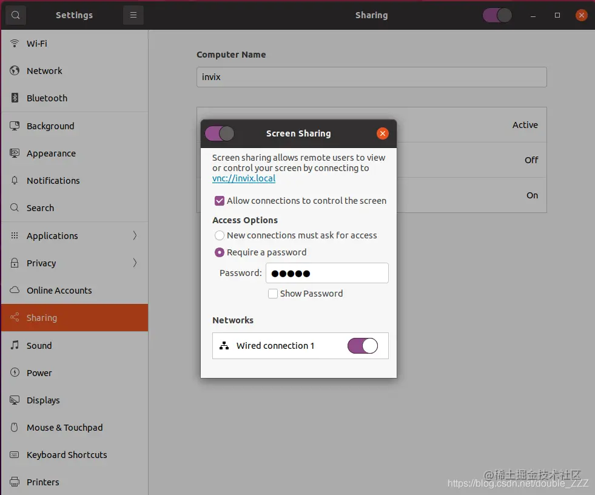
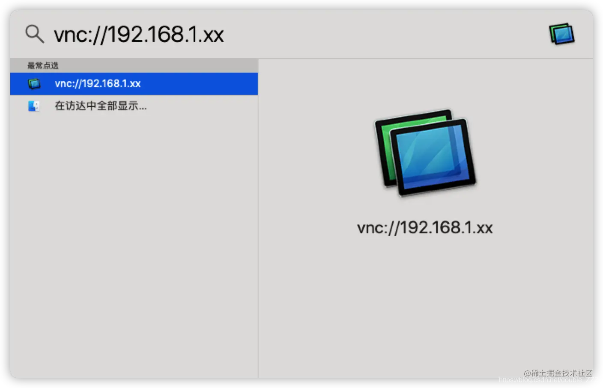

## VNC-Connection Within WLAN 

### Use the Macbook to monitor Ubuntu PC (only applied that PC is equipped with a monitor)
1. In the Ubuntu
[Link](https://juejin.cn/post/6939860863125815303)
```
sudo apt-get install x11vnc -y
sudo x11vnc -storepasswd /etc/x11vnc.pass
echo "
[Unit]
Description=Start x11vnc at startup.
After=multi-user.target
[Service]
Type=simple
ExecStart=/usr/bin/x11vnc -auth /run/user/1000/gdm/Xauthority -forever -loop -noxdamage -repeat -rfbauth /etc/x11vnc.pass -rfbport 5900 -shared
[Install]
WantedBy=multi-user.target 
" > /etc/systemd/system/x11vnc.service
sudo systemctl enable x11vnc
sudo service x11vnc start
```
And go to ```Setting -> Sharing``` to open the ```Screen Sharing```
<div align="center">
  <a href="">
    
  </a> 
</div>

2. In the Macbook
Open the search and enter ```cmd```, and enter ```vnc://your_ip```
<div align="center">
  <a href="">
    
  </a> 
</div>